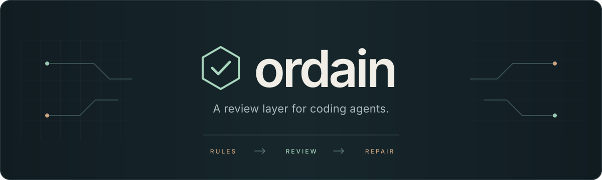

<div align="center">
  
  <br><br>
  <p><strong>Keep repository rules in the loop when coding agents lose the context.</strong></p>
  <p>
    <a href="LICENSE"></a>
  </p>
  <p>
    <a href="docs/getting-started.md">Get started</a> &nbsp;·&nbsp;
    <a href="docs/README.md">Documentation</a> &nbsp;·&nbsp;
    <a href="CONTRIBUTING.md">Contributing</a>
  </p>
</div>

---

Ordain checks agent edits against your repository's instructions, then sends
findings back through native hooks. It is written in Rust, works across source
languages, and uses TypeSafe's Jev model for contextual rules that linters cannot
express.

Ordain judges; the coding agent writes the repair. A post-edit finding does not
undo the edit. End-of-turn checks catch changes missed by individual edit hooks.

## Start here

Requires Git and a Unix-like system. From this source checkout:

```sh
mise install
mise exec -- cargo install --locked --path .
```

In the repository you want to check:

```sh
ordain login                       # securely store your judge API key
ordain preset add core             # optional starter rules; notices by default
ordain integration install codex   # or claude, opencode, hermes
ordain integration status codex
```

Start a fresh host session and approve Codex hooks in `/hooks`. Hermes needs an
explicit `--workspace` path. [The setup guide](docs/getting-started.md) covers each
host and compiling your own `AGENTS.md` or `CLAUDE.md` into review rules.

## Make it yours

- **Your rules:** instruction-derived rubrics, or optional core, Rust and TypeScript presets.
- **Your policy:** per-rule confidence thresholds, notices, steering, repair requests and evidence scope.
- **Your workflow:** native Claude Code, Codex, OpenCode and Hermes integrations; standalone checks and history replay.
- **Visible failures:** missing evidence and provider errors are reported, not counted as clean reviews.

Selected code and task context are sent to the configured judge provider. Ordain
is not a sandbox, a replacement for tests or linters, or a guarantee of correct
code. Read the [privacy and limits](docs/limits.md) and
[verification status](docs/verification.md) before enabling it on sensitive work.

## Development

```sh
mise run verify   # formatting, Clippy, tests and build; no provider key needed
```

See [contributing](CONTRIBUTING.md) for focused changes and native integration tests.
Licensed under [MIT](LICENSE).
